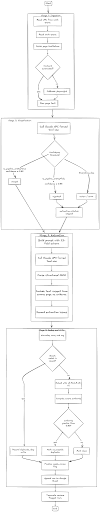

## Global Talent Pipeline Database Design

### Context

This document outlines the design for a program that extracts relevant fields from URLs representing potential biosecurity talent development programs.

### Open Questions

- **Active-status detection rules:** refine the heuristics combining `active_status_hint` with fetch signals once we've seen real failure patterns.

---

## Architecture



---

## Input / Output

### Stage 1: Ingestion

For each region, one team member runs three Gemini Deep Research prompts. Each prompt corresponds to a different program category:

1. **Formal Training & Academic Pipelines** — degrees, certificates, short courses, summer schools
2. **Fellowships, Competitions, Internships & Mentorship Programmes** — non-degree structured opportunities
3. **Government, Multilateral & Institutional Capacity-Building Programmes** — gov, bilateral, multilateral, regional body, lab network, funder initiatives

Each prompt returns a Google Doc with category-specific columns. The three prompts intentionally use different column schemas because they surface different metadata.

A separate preprocessing utility, `docs_to_csv.py`, parses these Google Docs, normalizes across the three heterogeneous column schemas, and emits a single unified work queue CSV. The CSV carries only the minimal hint set needed for routing and verification.

Stage 1 produces a persistent, timestamped snapshot of each source page. Persisting `raw_text` once means Stage 2 can be re-run as the schema evolves without re-fetching every page or paying repeatedly for page content in API tokens.

#### Input schema

| Field | Description |
|---|---|
| `url` | Program page URL |
| `name_hint` | Unverified program name from Gemini |
| `lead_org_hint` | Unverified host organization |
| `country_hint` | Unverified country |
| `type_hint` | `formal_training` \| `fellowship_competition` \| `gov_multilateral` |
| `active_status_hint` | `active` \| `inactive` \| `unknown` |
| `region_hint` | e.g. `north_america`, `south_asia` |
| `source_doc_id` | Provenance back to the originating Gemini doc |

`type_hint` corresponds to the three Gemini prompt categories. Stage 1 normalizes these to the current pipeline category names (`formal_training`, `non_degree_structured`, `gov_institutional`) before storing them in `hints.type`. The fine-grained `pipeline_type` is extracted from page content in Stage 3.

Hints are nested under `hints` in the output to mark the provenance boundary: everything inside is unverified Gemini output, everything outside is pipeline-produced.

#### Example input row

```
url: https://centerforhealthsecurity.org/our-work/research-projects/elbi
name_hint: ELBI Fellowship
lead_org_hint: Johns Hopkins Center for Health Security
country_hint: USA
type_hint: fellowship_competition
active_status_hint: active
region_hint: north_america
source_doc_id: na_fellowships
```

#### Processing

For each row: fetch page content via `trafilatura` with a Playwright fallback for JS-rendered pages. Record `fetch_method`, `fetched_at`, and `fetch_status`. Hints pass through unchanged to Stage 2.

`fetch_status` is one of `ok`, `failed`, or `partial`. Records with `fetch_status != "ok"` still flow through to Stage 2. Stage 2 returns an empty extraction and Stage 3 flags `needs_review`, so failures appear in the final sheet rather than being silently dropped.

#### Output (one JSON file per record, written to `data/raw/`)

```json
{
  "url": "https://centerforhealthsecurity.org/our-work/research-projects/elbi",
  "hints": {
    "name": "ELBI Fellowship",
    "lead_org": "Johns Hopkins Center for Health Security",
    "country": "USA",
    "type": "fellowship_competition",
    "active_status": "active",
    "region": "north_america"
  },
  "source_doc_id": "na_fellowships",
  "fetched_at": "2026-04-09T14:23:11Z",
  "fetch_method": "trafilatura",
  "fetch_status": "ok",
  "raw_text": "The Emerging Leaders in Biosecurity Fellowship (ELBI) is a part-time, year-long program..."
}
```

---

### Stage 2: Classification

**Input:** Stage 1 output (`data/raw/*.json`).

**Purpose:** Stage 1 input comes from Gemini Deep Research prompts that prioritize recall — the URLs include non-biosecurity entries (funder landing pages, press releases, generic org homepages). This stage filters records before extraction using Sonnet 4.6 (`claude-sonnet-4-6`) to reduce noise.

**Processing:** All records are submitted as a single Anthropic Batch API request (`client.messages.batches.create()`). The classifier uses forced tool use (`classify_program`) against a detailed system prompt containing scope rules, edge cases, and confidence calibration guidance.

The system prompt is cached across all records via `cache_control: {"type": "ephemeral"}` on the system message block.

#### Scope rules

**In scope:**
- Programs with identifiable individual participants, defined activities, time- or credential-bounded scope, and biosecurity-relevant content (degrees, certificates, fellowships, internships, competitions, conferences with early-career tracks, government training, bilateral/multilateral capacity-building, lab network training, professional certification)
- Funders whose primary or named focus includes biosecurity talent or workforce development

**Out of scope:**
- Articles, reports, blog posts, press releases about programs
- National biosecurity strategy documents and white papers
- Generic org homepages without a specific program described
- Programs outside biosecurity scope (general public health, general epidemiology, agricultural biosecurity)
- One-off events without ongoing cohort structure

**Edge cases:**
- Inactive/closed programs → in scope (activity status is a separate field)
- Degree programs with biosecurity specialization → in scope if substantive
- Multi-country programs → single entity
- One Health programs → in scope only if GCBR-relevant framing

#### Classifier tool output

```json
{
  "is_pipeline_entity": true,
  "confidence": 0.92,
  "reasoning": "One sentence explaining the decision",
  "evidence": "Verbatim snippet from the page"
}
```

#### Tiered routing

Thresholds are configured in `config/classification.yaml`:

```
high_accept_threshold: 0.85
high_reject_threshold: 0.95
```

| Condition | Status |
|---|---|
| `is_pipeline_entity == true` AND `confidence >= high_accept_threshold` | `accept` |
| `is_pipeline_entity == false` AND `confidence >= high_reject_threshold` | `rejected` |
| Everything else | `review` |
| API/parse errors | `error` (routed to review tier) |

The reject threshold (0.95) is deliberately higher than the accept threshold (0.85) because the classifier has a strong positive bias — it tends to classify most pages as pipeline entities. A high reject threshold ensures we only auto-reject when the classifier is very confident.

#### Output (one JSON file per record, written to `data/classified/`)

Same structure as Stage 1 JSON, enriched with classification fields:

```json
{
  "...all Stage 1 fields...",
  "classification_status": "accept | review | rejected | error",
  "classification_confidence": 0.92,
  "classification_reasoning": "One-sentence explanation",
  "classification_evidence": "Verbatim snippet from raw_text"
}
```

#### Calibration

Thresholds were tuned using `scripts/calibrate_classifier.py` against 40 labeled fixtures in `tests/fixtures/classification/`. The calibration methodology minimizes wrong-rejects (losing real pipeline entries, weight 3x) first, then wrong-accepts (noise flowing to extraction, weight 1x). Results are documented in `docs/calibration_report.md`.

---

### Stage 3: Extraction

**Input:** Stage 2 output (`data/classified/*.json`) plus the 17-field extraction schema.

**Filtering:** Only records with `classification_status == "accept"` are sent to the Claude API for extraction. Records with other statuses (review, rejected, error) are passed through with empty extraction fields and `extraction_status: "skipped"`.

**Processing:** one Claude API call per accepted record, using forced tool use against a tool definition that mirrors the 17-field extraction schema. The tool requires an `evidence` snippet for each field value.

- Model is pinned to a specific version string (e.g. `claude-sonnet-4-6`), not `latest`.
- Hints are passed in the system prompt as beliefs to verify, not as answers. Example framing: *"The program is believed to be called ELBI Fellowship, based in the USA. Confirm or correct each field based on the page content."* When extraction disagrees with a hint, the disagreement is logged in `hint_conflicts`.
- After extraction, each field's `evidence` snippet is checked against `raw_text` using fuzzy matching (`rapidfuzz.partial_ratio >= 90`). Normalization before matching: lowercase, collapse whitespace, strip punctuation. Fields that fail grounding are retained but marked `grounded: false`.
- On malformed tool output (parse error, missing required fields, API error): retry up to 3 times with exponential backoff. If all retries fail, emit a record with empty field values, `extraction_status: "failed"`, and a populated `failure_reason`. The record still flows downstream so the failure is visible for manual review.

#### Output (`output/stage3_results.csv`)

CSV columns include classification metadata from Stage 2 (`classification_status`, `classification_confidence`, `classification_reasoning`) followed by extraction fields. `pipeline_category` is derived programmatically from `pipeline_type`. All records from Stage 2 appear in the CSV — non-accepted records have empty extraction fields.

### Stage 4: Dedup (`src/stage4_dedup.py`)

Reads `output/stage3_results.csv`, drops duplicate rows, writes `output/stage4_results.csv`. Two-pass design:

- **Pass 1 (rapidfuzz, no API cost)**: pairwise `fuzz.WRatio` over normalized `name_and_title` and `organisation_providing_course`. Pairs with `name_score >= 92 AND org_score >= 80` are auto-confirmed dupes. Pairs with `name_score in [55, 92)`, OR `name_score < 55 AND org_score >= 90 AND same country`, are escalated to Pass 2. Everything else is discarded.
- **Pass 2 (Claude Batch API)**: borderline pairs are sent to Sonnet 4.6 with forced tool use; the tool returns `same_program: bool, confidence: float`. Pairs where `same_program == true AND confidence >= 0.85` join the confirmed-dupe set.

The Pass 1 borderline triggers are deliberately generous so that acronym ↔ full-name pairs (e.g., "ELBI" vs "Emerging Leaders in Biosecurity Initiative") — which rapidfuzz cannot detect on its own — still reach the LLM.

Confirmed-dupe pairs are merged via union-find. For each cluster the canonical row is picked by ranking on `extraction_status == "ok"` → `fetch_status == "ok"` → most non-empty fields → first occurrence. Output adds three columns:

- `program_id` — first 12 chars of `sha256(normalized_name + "|" + normalized_org)`. Stable across runs.
- `source_doc_ids` — pipe-joined union of `source_doc_id` values across all cluster members, preserving provenance.
- `duplicate_count` — `len(cluster) - 1`.

Thresholds live in `config/dedup.yaml` and are calibrated via `scripts/calibrate_dedup.py` against `tests/fixtures/duplicate_candidates.csv`. The candidate CSV is generated by `python src/stage4_dedup.py --dump-candidates` with best-guess labels pre-filled; the user reviews and corrects the `is_duplicate` column in batch.
```

---

## Schemas

### Extraction schema — 18 fields (Stage 3 tool definition)

| # | Field | Notes |
|---|---|---|
| 1 | Name & Title | Full official program name |
| 2 | Organisation Providing Course | Host / delivering organization |
| 3 | Pipeline Type | Fine-grained type: `degree` \| `certificate` \| `short_course` \| `summer_school` \| `online` \| `fellowship` \| `internship` \| `competition` \| `scholarship` \| `mentorship` \| `conference` \| `association` \| `gov_training` \| `bilateral` \| `multilateral` \| `regional_body` \| `lab_network` \| `funder_initiative` \| `national_strategy` \| `other` |
| 3b | Pipeline Category | Derived from Pipeline Type: `formal_training` \| `non_degree_structured` \| `gov_institutional` (not extracted by Claude) |
| 4 | Country | Country/countries where delivered |
| 5 | Organisation Funding Course | Funder(s) |
| 6 | Expected Outcomes | Stated learning or career outcomes |
| 7 | Syllabus / Course Materials | Topics, modules, curriculum links |
| 8 | Career Stage | `undergraduate \| postgraduate \| early_career \| mid_career \| senior \| professional \| unknown` (pipe-delimited) |
| 9 | Financial Support Available | `full \| partial \| free \| none \| unknown` |
| 10 | Visa / Travel Constraints | `yes \| no \| n/a \| unknown` |
| 11 | Language(s) | Delivery language(s) |
| 12 | Year Established | Year founded or first offered |
| 13 | Active Status | `active` \| `inactive` \| `unknown` |
| 14 | Income Classification | `HIC` \| `LMIC` \| `Both` |
| 15 | Format | e.g. in-person, online, hybrid, part-time, full-time |
| 16 | Focus Area | `dna_synthesis_screening \| policy_governance \| biosurveillance \| lab_biosafety \| pandemic_preparedness_and_response \| ai_biosecurity` (pipe-delimited) |
| 17 | AI Risks Content Included | `Y` \| `N` |
| 18 | Dual-Use Risks Content Included | `Y` \| `N` |

### Record metadata (written alongside content fields)

| Field | Description |
|---|---|
| `program_id` | Deterministic hash of normalized `name + org` |
| `needs_review` | `true` if any review condition triggered |
| `review_reasons` | List of conditions that triggered `needs_review` |
| `classification_status` | `accept` \| `review` \| `rejected` \| `error` |
| `classification_confidence` | 0.0–1.0 confidence from classifier |
| `extraction_status` | `ok` \| `failed` \| `skipped` |
| `fetch_status` | `ok` \| `failed` \| `partial` |
| `hint_conflicts` | Fields where extraction disagreed with a Gemini hint |
| `source_doc_id` | Provenance back to the originating Gemini doc |

