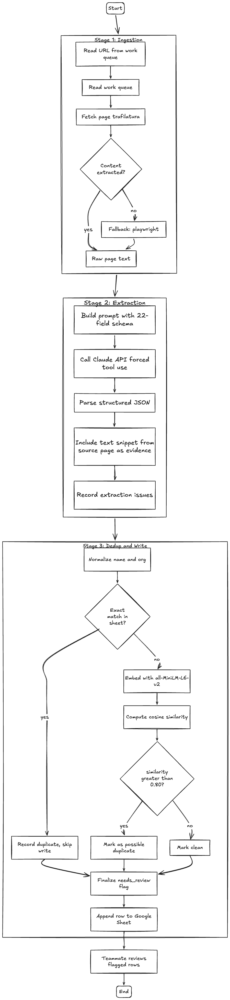

## Global Talent Pipeline Database Design

### Context

This document outlines the design for a program that extracts relevant fields from URLs representing potential biosecurity talent development programs.

### Open Questions

- **Cosine threshold calibration:** 0.80 is a starting point. Validate against a labeled set of known duplicates (e.g., ELBI appearing across multiple regional docs).
- **Active-status detection rules:** refine the heuristics combining `active_status_hint` with fetch signals once we've seen real failure patterns.

---

## Architecture



---

## Input / Outputs

### Stage 1: Ingestion

For each region, one team member runs three Gemini Deep Research prompts. Each prompt corresponds to a different program category:

1. **Formal Training & Academic Pipelines** — degrees, certificates, short courses, summer schools
2. **Fellowships, Competitions, Internships & Mentorship Programmes** — non-degree structured opportunities
3. **Government, Multilateral & Institutional Capacity-Building Programmes** — gov, bilateral, multilateral, regional body, lab network, funder initiatives

Each prompt returns a Google Doc with category-specific columns. The three prompts intentionally use different column schemas because they surface different metadata.

A separate preprocessing utility, `docs_to_csv.py`, parses these Google Docs, normalizes across the three heterogeneous column schemas, and emits a single unified work queue CSV. The CSV carries only the minimal hint set needed for routing and verification.

Stage 1 produces a persistent, timestamped snapshot of each source page. Persisting `raw_text` once means Stage 2 can be re-run as the schema evolves without re-fetching every page or paying repeatedly for page content in API tokens.

#### Input schema

| Field | Description |
|---|---|
| `url` | Program page URL |
| `name_hint` | Unverified program name from Gemini |
| `lead_org_hint` | Unverified host organization |
| `country_hint` | Unverified country |
| `type_hint` | `formal_training` \| `fellowship_competition` \| `gov_multilateral` |
| `active_status_hint` | `active` \| `inactive` \| `unknown` |
| `region_hint` | e.g. `north_america`, `south_asia` |
| `source_doc_id` | Provenance back to the originating Gemini doc |

`type_hint` corresponds to the three Gemini prompt categories. The fine-grained `Format` field is extracted from page content in Stage 2.

Hints are nested under `hints` in the output to mark the provenance boundary: everything inside is unverified Gemini output, everything outside is pipeline-produced.

#### Example input row

```
url: https://centerforhealthsecurity.org/our-work/research-projects/elbi
name_hint: ELBI Fellowship
lead_org_hint: Johns Hopkins Center for Health Security
country_hint: USA
type_hint: fellowship_competition
active_status_hint: active
region_hint: north_america
source_doc_id: na_fellowships
```

#### Processing

For each row: fetch page content via `trafilatura` with a Playwright fallback for JS-rendered pages. Record `fetch_method`, `fetched_at`, and `fetch_status`. Hints pass through unchanged to Stage 2.

`fetch_status` is one of `ok`, `failed`, or `partial`. Records with `fetch_status != "ok"` still flow through to Stage 2. Stage 2 returns an empty extraction and Stage 3 flags `needs_review`, so failures appear in the final sheet rather than being silently dropped.

#### Output (one JSON file per record, written to `data/raw/`)

```json
{
  "url": "https://centerforhealthsecurity.org/our-work/research-projects/elbi",
  "hints": {
    "name": "ELBI Fellowship",
    "lead_org": "Johns Hopkins Center for Health Security",
    "country": "USA",
    "type": "fellowship_competition",
    "active_status": "active",
    "region": "north_america"
  },
  "source_doc_id": "na_fellowships",
  "fetched_at": "2026-04-09T14:23:11Z",
  "fetch_method": "trafilatura",
  "fetch_status": "ok",
  "raw_text": "The Emerging Leaders in Biosecurity Fellowship (ELBI) is a part-time, year-long program..."
}
```

---

### Stage 2: Extraction

**Input:** the Stage 1 output JSON plus the 17-field extraction schema.

**Processing:** one Claude API call per record, using forced tool use against a tool definition that mirrors the 17-field extraction schema. The tool requires an `evidence` snippet for each field value.

- Model is pinned to a specific version string (e.g. `claude-sonnet-4-6`), not `latest`.
- Hints are passed in the system prompt as beliefs to verify, not as answers. Example framing: *"The program is believed to be called ELBI Fellowship, based in the USA. Confirm or correct each field based on the page content."* When extraction disagrees with a hint, the disagreement is logged in `hint_conflicts`.
- After extraction, each field's `evidence` snippet is checked against `raw_text` using fuzzy matching (`rapidfuzz.partial_ratio >= 90`). Normalization before matching: lowercase, collapse whitespace, strip punctuation. Fields that fail grounding are retained but marked `grounded: false`, contributing a reason to `needs_review` in Stage 3.
- On malformed tool output (parse error, missing required fields, API error): retry up to 3 times with exponential backoff. If all retries fail, emit a record with empty field values, `extraction_status: "failed"`, and a populated `failure_reason`. The record still flows to Stage 3 so the failure is visible for manual review.

#### Output

```json
{
  "extraction_status": "ok",
  "fields": {
    "program_name": {
      "value": "Emerging Leaders in Biosecurity Fellowship",
      "evidence": "The Emerging Leaders in Biosecurity Fellowship (ELBI) is a part-time, year-long program",
      "grounded": true
    },
    "host_organization": {
      "value": "Johns Hopkins Center for Health Security",
      "evidence": "Established in 2010 by the Johns Hopkins Center for Health Security",
      "grounded": true
    }
  },
  "hint_conflicts": [
    {
      "field": "country",
      "hint_value": "USA",
      "extracted_value": "USA, Canada",
      "evidence": "open to applicants based in the US or Canada"
    }
  ]
}
```

---

## Schemas

The pipeline distinguishes the **extraction schema** (what Claude returns in Stage 2) from the **record schema** (what ends up in the Google Sheet after Stage 3). Separating the two keeps the LLM focused on fields actually extractable from page content, and avoids asking it to guess values the pipeline already knows.

### Extraction schema — 17 fields (Stage 2 tool definition)

| # | Field | Notes |
|---|---|---|
| 1 | Name & Title | Full official program name |
| 2 | Organisation Providing Course | Host / delivering organization |
| 3 | Pipeline Type | `formal_training` \| `fellowship_competition` \| `gov_multilateral` |
| 4 | Country | Country/countries where delivered |
| 5 | Organisation Funding Course | Funder(s) |
| 6 | Expected Outcomes | Stated learning or career outcomes |
| 7 | Syllabus / Course Materials | Topics, modules, curriculum links |
| 8 | Target Audience | Career stage, background, nationality requirements |
| 9 | Financial Support Available | Stipends, scholarships, travel grants, waivers |
| 10 | Visa / Travel Constraints | Nationality restrictions, travel obligations |
| 11 | Language(s) | Delivery language(s) |
| 12 | Year Established | Year founded or first offered |
| 13 | Income Classification | `HIC` \| `LMIC` \| `Both` |
| 14 | Format | e.g. in-person, online, hybrid, part-time, full-time |
| 15 | Focus Area | e.g. biosurveillance, policy, lab biosafety, threat assessment |
| 16 | AI Risks Content Included | `Y` \| `N` |
| 17 | Dual-Use Risks Content Included | `Y` \| `N` |

### Pipeline-populated fields — 4 fields (Stage 3)

| Field | Source |
|---|---|
| Region | `hints.region` |
| Resource Attachment | `url` |
| Date Retrieved | `fetched_at` |
| Is Program Currently Active? | `hints.active_status` + `fetch_status` (e.g. HTTP 404 → `inactive`) |

### Record metadata (written alongside content fields)

| Field | Description |
|---|---|
| `program_id` | Deterministic hash of normalized `name + org` |
| `needs_review` | `true` if any review condition triggered |
| `review_reasons` | List of conditions that triggered `needs_review` |
| `extraction_status` | `ok` \| `failed` |
| `fetch_status` | `ok` \| `failed` \| `partial` |
| `hint_conflicts` | Fields where extraction disagreed with a Gemini hint |
| `source_doc_id` | Provenance back to the originating Gemini doc |

---

## Stage 3: Dedup and Write

**Input:** Stage 2 output record plus upstream data from Stage 1 (hints, fetch metadata, `raw_text`).

### Processing

**Populate pipeline-managed fields** from hints and fetch metadata (see table above).

**Mint `program_id`:** deterministic hash of `normalized_name + normalized_org`. Normalization: lowercase, strip punctuation, remove stopwords (`the`, `of`, `for`), collapse whitespace. Re-runs on the same program produce the same ID.

**Exact dedup:** apply the same normalization to `program_name` and `host_organization`. If the result matches any existing row exactly, flag as duplicate and skip write.

**Cosine similarity:** for records that don't match exactly, compute an embedding using `sentence-transformers` `all-MiniLM-L6-v2` over: `program_name || host_organization || country || raw_text[:200]`. Using `raw_text` rather than an extracted field gives a more stable similarity signal.

- Similarity ≥ 0.80 → write with `needs_review: true`, `review_reasons` includes `"possible_duplicate_of:<program_id>"`
- Similarity < 0.80 → write as new record

**Finalize `needs_review`:** `true` if any of the following hold:

1. `fetch_status != "ok"`
2. `extraction_status != "ok"`
3. Any field has `grounded: false`
4. `hint_conflicts` is non-empty
5. Cosine similarity ≥ 0.80 against an existing record

### Output: Google Sheets write

**Programs tab:** one row per program, 17 content columns + 4 pipeline-populated columns + metadata columns.

**Evidence tab (one per program):** named by `program_id`. One row per extracted field with columns: `field_name`, `value`, `evidence`, `grounded`.
